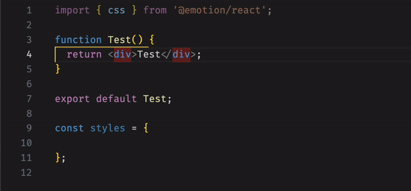

# Emotion Check 

It will show a yellow underline to all unused emotion variables

[Download Link](https://marketplace.visualstudio.com/items?itemName=Sifat.emotion-check)

---

### ✨ Features

- **Active Editor Highlighting**: Automatically identifies unused emotion styles in your current file and highlights them with a yellow wavy underline.
- **Workspace-Wide Scanning (New!)**: Performs a comprehensive scan across all files (`.js`, `.jsx`, `.ts`, `.tsx`) in your project workspace. Unused emotion variables will now appear right in your native VS Code **Problems panel**.
  - Re-scans specific files automatically whenever you hit **Save**.
  - You can manually trigger a full project sweep using the Command Palette: `Emotion Check: Scan Workspace`.
- **AST-Powered Accuracy (New!)**: Re-engineered with the TypeScript Compiler API, ensuring robust detection. Accurately understands JavaScript scope, destructuring (`const { myStyle } = styles`), spread usage, string interpolations, and ignores commented-out code.
